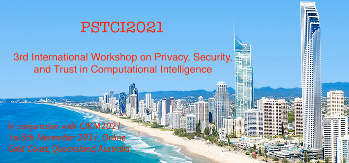
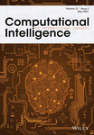

---
# Feel free to add content and custom Front Matter to this file.
# To modify the layout, see https://jekyllrb.com/docs/themes/#overriding-theme-defaults

layout: home
#layout: page
#title: PSTDA@DSAA2022
permalink: /

---
<!--  -->

	

 

Welcome to the DSAA2022 Special Session on Private, Secure, and Trust Data Analytics (PSTDA2022). It is a satellite workshop co-located with the 30th ACM International Conference on Information and Knowledge Management ([CIKM2021](https://www.cikm2021.org/)), which will be an online virtual event taking place during November 1st - 5th, 2021.

 

 The enormous computation, communication and storage capabilities of the state-of-the-art computing paradigms such as cloud computing, Internet of Things (IoTs) and edge computing, have enabled a variety of large-scale applications and services that generate big data. It is high time to investigate the privacy, security and trust (PST) issues occur in computation intelligence to cater for the era of cloud/edge computing and big data.
 

 

 PSTCI2021 aims at providing a forum for researchers, practitioners and developers from different background areas such as computational intelligence, data privacy and cyber security, trust management, cloud computing, edge computing, Internet of Things, big data analytics, machine learning and data mining, knowledge discovery to exchange the latest experience, research ideas and synergic research and development on fundamental issues and applications about privacy, security and trust issues in computational intelligence. This workshop invites authors to submit original manuscripts that demonstrate and explore current advances in all related areas mentioned above. High-quality accepted papers will be recommended to the associated journal special issues (see more details in <a href="https://xuyun-zhang.github.io/pstci2021/cfp/">Call for Papers</a>. 

 

	
	
	

